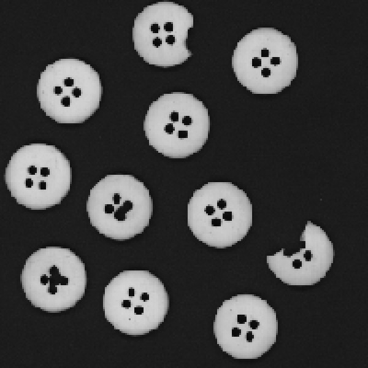
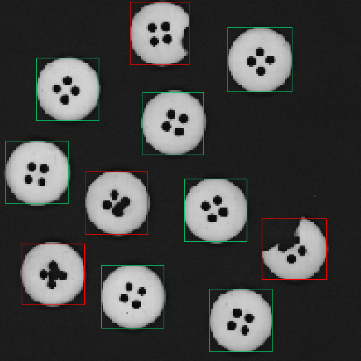
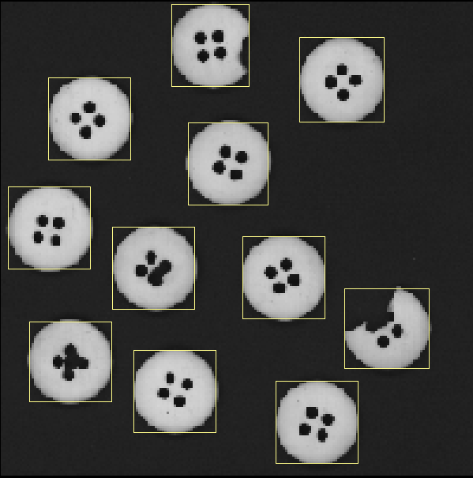
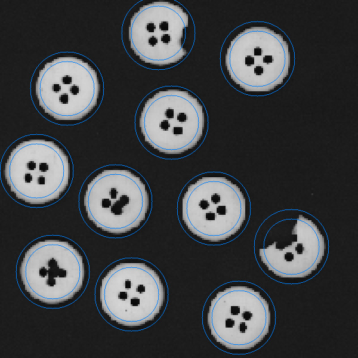
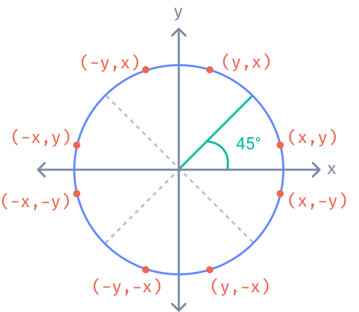
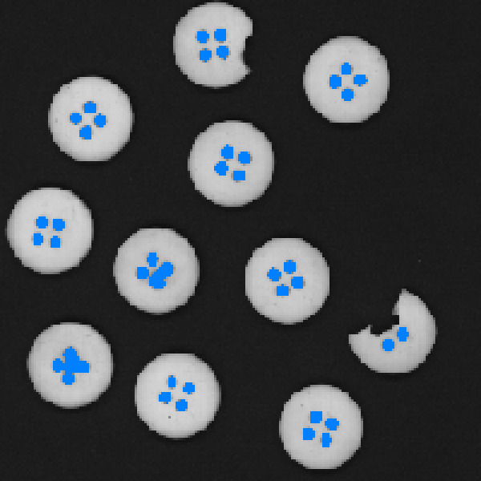

# Backtracking Buttons

An image processing program that detects buttons in black-and-white scans and
classifies them as broken or OK using a backtracking algorithm and custom C++
iterators repurposed as geometric generators.

Read the full write-up: [Repurposing C++ Iterators as Geometric Generators](https://tessapower.xyz/blog/custom-iterators-as-generators)

## Overview

A button manufacturing line produces scans of buttons that need quality control.
This program automates that process — it reads a PPM image, identifies individual
buttons using a flood-fill algorithm, and assesses each one against three criteria:

1. The button must be **circular** (its edge should fall between two concentric circles)
2. It must have **no obviously broken edges**
3. It must have exactly **four interior holes**

Buttons that pass all checks get a green bounding box; broken buttons get a red one.

<p align="center">
  
  
</p>

## How It Works

### 1. Discover All Buttons

The program scans every pixel in the image. When it finds an unvisited pixel that
is part of a button, it uses a **recursive backtracking flood-fill** to discover
the full extent of the connected region, producing a bounding rectangle.

<p align="center">
  
</p>

### 2. Check for Broken Edges with Concentric Circles

For each button, two concentric circles are drawn — an **outer circle** (1.2x the
radius) and an **inner circle** (0.9x the radius). A well-formed button's pixelated
edge should fall between these two circles:

- If button pixels appear **on or beyond the outer circle**, the edge is ragged
- If non-button pixels appear **inside the inner circle**, the edge is eroded

<p align="center">
  
</p>

The circles are iterated using a custom `CircumferenceIterator` that generates
points on the fly using Bresenham's circle algorithm. Instead of completing one
octant before moving to the next, the iterator **jumps between all eight octants**
at each step — this means broken edges are detected faster since damage at any
position on the circle is found early.

<p align="center">
  
  
</p>

### 3. Count Buttonholes

Within the inner circle's bounding box, the algorithm runs a second flood-fill to
find isolated empty regions. Only regions **fully enclosed** within the bounds count
as buttonholes. A valid button must have exactly four.

<p align="center">
  
</p>

## Example Input and Output

**Input:** A PPM (P3 ASCII) image containing a scan of buttons on a dark background.

**Output:** A new PPM image with bounding boxes drawn around each button:
- **Green** — button is OK
- **Red** — button is broken (irregular shape, damaged edge, or wrong number of holes)

```
$ ./main
Writing to .../buttons_processed.ppm
```

## Requirements

- C++20
- CMake 3.25+

## How to Build

```bash
cmake -B build -S .
cmake --build build
```

The executable will be at `build/bin/main` (or `build/bin/Debug/main` on Windows).
Input PPM files are located in the `ppm/` directory, and the processed output is
written to `ppm/buttons_processed.ppm`.
